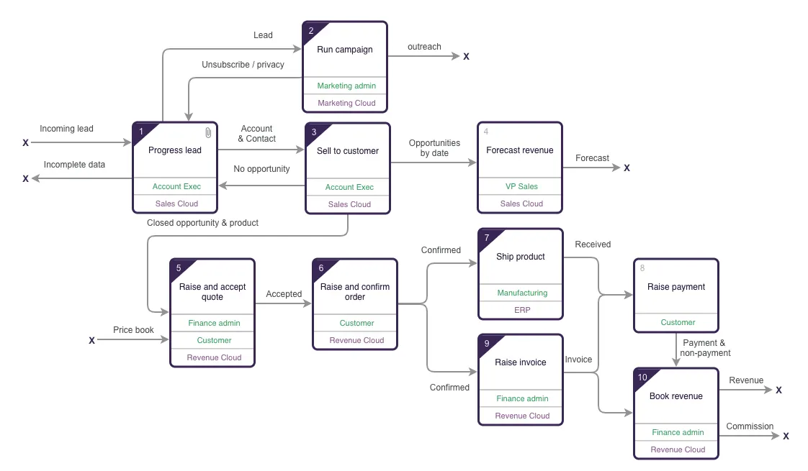
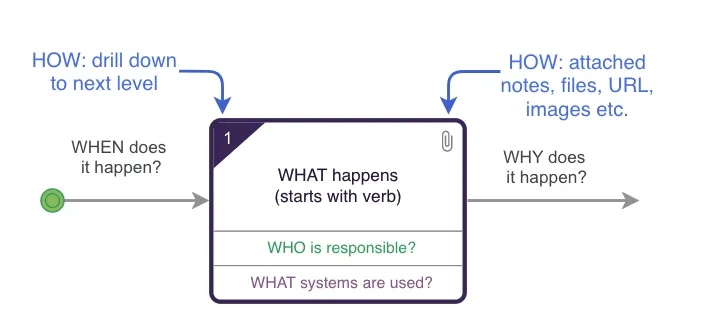
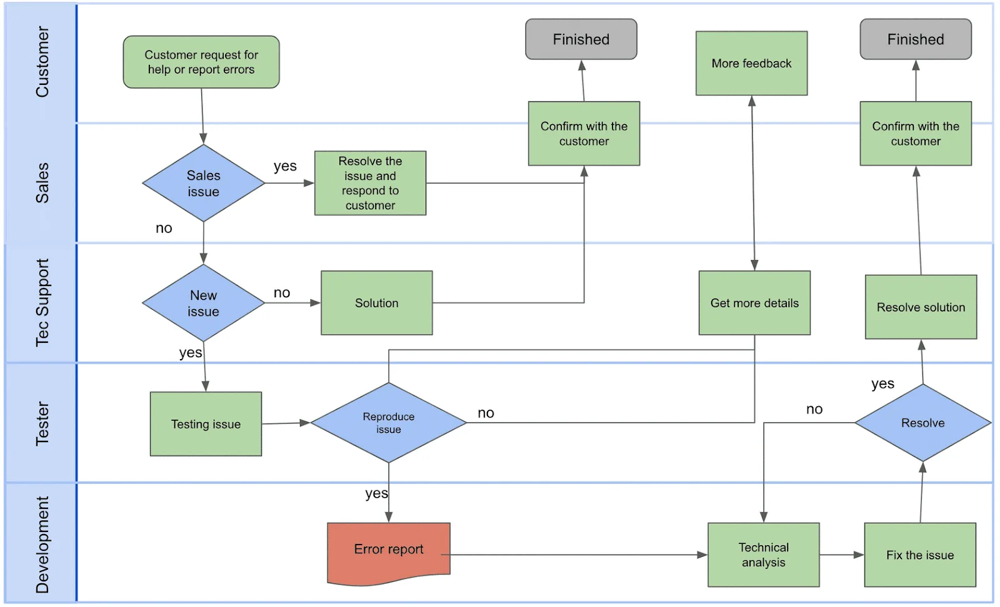
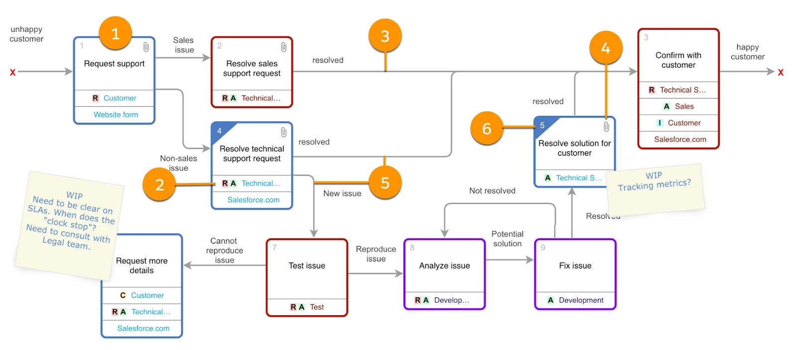

# Business Process Mapping

## The Value of Business Analysis

*Business process mapping* creates visual representations of business processes. A business process map includes any activity that defines what a business does, who is responsible for what, how standard business processes are completed, and how success is measured. The main purpose of business process mapping is to show the relationship between the steps and the inputs of a business to establish a clear, consistent, and concise result. It takes a specific objective and compares that objective to the organization’s overall objectives to make sure their processes are aligned with the company’s values and capabilities.

## The Purpose of Process Mapping

There are a number of reasons companies need a new or improved business process map, but most commonly they are used to foster a formal approach to quality management. As a business analyst, process mapping is a crucial tool you can use for a range of project types—from improvement projects to more intensive re-engineering projects. Process maps help you look at existing workflows in a new way and help you keep your focus on strategic planning.

Process mapping is a beneficial tool for you and your company. The two most important or most common uses of process mapping are to: 

- Make understanding and communicating the process much easier among teams, stakeholders, or customers.
- Help identify flaws in the process and where improvements should be made.

Process mapping also helps reduce costs, improve team performance, and increase employee satisfaction.

## Good BPN Means Better Architecture

We know these skills are important, but how and why do business process mapping skills really impact the work of designing and building a solution? Business analysis is a prerequisite for strong architecture for a few reasons. 

**Business analysis increases Salesforce adoption.** Companies may think they know what end users want, but it takes business analysis to understand what end users need. Analysis helps you build apps quickly but, most importantly, it helps you know that you're building the right ones.

**Business analysis reduces rework:** A well-documented business process leads to better requirements with less ambiguity between end users, analysts, architects, and developers. All of this means less time spent trying to understand what is required, which results in less rework and less frustration.

**Business analysis impacts architecture.** Salesforce professionals need to understand the business process, and therefore the app in context, because the process informs the data model, performance considerations, and metrics collection. If you understand the business process, you can also pinpoint where it can flex and change to make the app perform better.

**Business analysis increases agility and drives digital transformation.** We’re in the midst of a digital transformation, and in order to keep pace with the market, businesses need to be able to pivot quickly. Agile analysis provides confidence that a business model will stay relevant, and it encourages a mindset of continuous improvement. 

## Business Process Mapping Notation

An easily understood business process map can replace 1,000s of words. Which is why there are a number of different ways that business processes have been documented; business process map, flow diagrams, flowcharting, UML diagrams, value stream maps and SIPOC. 

There is a simpler and more engaging diagramming notation that has been designed to be easily understood by all the stakeholders and viewed online. It is proven over the last 20 years in major, highly regulated industries right down to innovative startups and small nonprofits. It is called UPN (Universal Process Notation) and it's not proprietary to any company and doesn’t require any specialized software.

A process map is a hierarchy of diagrams, meaning you are able to drill down to give more detail. This enables each diagram to be kept to 8–10 boxes, while being able to describe a broad scope or complex processes. There is no limit to the number of levels you can go down.

Process maps are version controlled, at a diagram level. The process map is the operational definition of the business and it will constantly evolve - but at different cadences. Lower level diagrams typically change more frequently driven by grass roots improvements and major innovation is driven top down.

Before beginning to build a process map, it's important to look at the subtle, but critical, aspects of UPN that are important to understand before leveraging it for business mapping.

**Five Principles of BPN**

- No more than 8-10 activity boxes on a screen
- Drill down from an activity box to a lower level to describe the detail
- Attach supporting information to an activity box
- View and edit controlled by access rights
- Version control and history of changes at a diagram level

**A UPN diagram:**

- Encapsulates every level of a process, from a top-level overview down to detailed, actionable diagrams.
- Can be viewed online and embedded within apps.
- Can be created collaboratively.
- Can have a broad or narrow scope.
- Supports regulatory and compliance considerations.
- Provides context for metrics and management decisions.

### Flowchart vs Process Map

This flowchart describes a relatively simple process. It has symbols of different colors, arrows, and swim lanes.  

Now let’s look at the same process, diagrammed using UPN. It’s tighter (there are fewer symbols), less ambiguous, and you can read it from left to right. 

1. **Activity box:** A verb phrase labels each activity box.
2. **Resource:** A resource in each activity box designates the who. Resources are tagged with RACI (responsible, accountable, consulted, and informed). Some teams choose to indicate who is “supporting” the work using a RASCI model.
3. **Line with text:** Lines with text connect every activity box to another box and represent the handoff between steps.
4. **Attachment:** Attachments provide documents, metadata, or metrics in the context of the process.
5. **Decision:** Several lines coming out of an activity box with line text explaining the flow represent a decision, simplifying the diagram.
6. **Drill down:** Any activity box can drill down to a lower-level diagram.